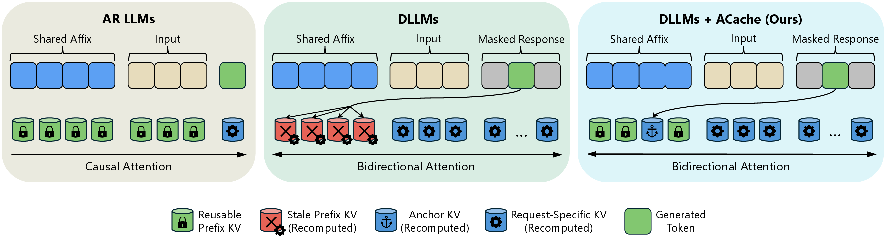

# ACache

Official code for [Affix Cache for Diffusion Large Language Models](https://arxiv.org/abs/2608.26140).

ACache enables affix-cache acceleration for diffusion large language models. It
reuses affix KV cache entries across requests while recomputing only anchor and
request-specific KV states.

<p align="center">
  
</p>

This repository contains the code needed to reproduce the **main-text experiments** of the ACache paper. Models and benchmark datasets are downloaded from their public sources; no model weights or full benchmark result logs are bundled. The two execution paths are Hugging Face evaluation (`llada/`, `dream/`) for accuracy, and `nano-vdllm/` for throughput, recomputation time, and KV-cache memory. The official BiCache comparison uses the code and precomputed policies under `third_party/BiCache/` and `policies/`.

## Main result map

| Paper result | Run directly | Configuration |
| --- | --- | --- |
| Figure 5 | `llada/` or `dream/` quality evaluators | Both models, GSM8K/MBPP/BABILong, prefix/infix/suffix, 1/2-shot; dKV-Cache and Fast-dLLM |
| Tables 2–4 | `nano-vdllm/run_eval.sh` | Fast-dLLM and ACache at ratio 0.2; GSM8K/MBPP, 1/2/4-shot, batch 1/4/16 |
| Table 5 | `eval_ACache.py`, `eval_CacheBlend_ACache.py`, `eval_ProphetKV_ACache.py`, `eval_BiCache_ACache.py`, and the official BiCache accuracy adapters | Matched selectors at ratios 0.2/0.3, 1-shot |
| Table 6 | `bicache_fast_dllm_system.py` and `dream_bicache_system.py` | Official BiCache + Fast-dLLM, batch 1, prefix, GSM8K/MBPP, 1/2/4-shot |

All examples below run one configuration. Repeat with seeds 0 and 1; use the complete benchmark split for the paper results. Make each output path distinct when running the same evaluator with another model, dataset, placement, ratio, shot count, or seed.

## Environment

The experiments used Python 3.12 and NVIDIA A100-SXM4-40GB GPUs. Install a PyTorch build matched to your CUDA runtime first; the experiments used PyTorch 2.5.1 with CUDA 12.1. Then install the Python dependencies and FlashAttention:

```bash
python3.12 -m venv .venv
source .venv/bin/activate
pip install torch==2.5.1 --index-url https://download.pytorch.org/whl/cu121
pip install -r requirements.txt
pip install flash-attn --no-build-isolation --no-cache-dir
```

The evaluator loads public Hugging Face model code for `GSAI-ML/LLaDA-8B-Instruct` and `Dream-org/Dream-v0-Instruct-7B`. It downloads GSM8K, `google-research-datasets/mbpp`, and `RMT-team/babilong-1k-samples` as needed. MBPP evaluation executes generated programs to score pass@1; the commands include the evaluator's explicit confirmation flag. Review the model and task code before running them. The BiCache profiler additionally uses `allenai/WildChat-4.8M`; the bundled policies allow Table 5/6 runs without repeating that profiling step.

## Run the experiments

Create the output directory, then run commands from the repository root unless a command changes directory:

```bash
mkdir -p outputs
```

**Figure 5: accuracy.** The model-specific shell scripts sweep Anchor ratios `0, 0.1, 0.2, 0.3, 0.5, 1.0` on Fast-dLLM. For example:

```bash
bash llada/eval_ACache_anchor_ratio.sh --seed 0 --dataset gsm8k --num-fewshot 1 --prefix
bash dream/eval_ACache_anchor_ratio.sh --seed 0 --dataset gsm8k --num-fewshot 1 --prefix
```

Change `--dataset` to `mbpp` or `babilong`, `--num-fewshot` to `1` or `2`, and placement to `--prefix`, `--infix`, or `--suffix`. Add `--confirm-run-unsafe-code` for MBPP. BABILong automatically uses generation length and block length 8; GSM8K and MBPP use 256 and 32. Repeat each setting with `--seed 1`.

For the dKV-Cache curve, call the corresponding evaluator directly. This is the LLaDA/GSM8K/prefix/1-shot/ratio-0.2 example:

```bash
cd llada
python eval_dKV_ACache.py --seed 0 --tasks gsm8k --num_fewshot 1 --batch_size 1 --trust_remote_code --model llada_dkv_acache_hf --model_args "model_path=GSAI-ML/LLaDA-8B-Instruct,gen_length=256,steps=256,block_length=32,threshold=0.9,affix_type=prefix,anchor_ratio=0.2,selection_mode=top,dkv_steps=256,dkv_cache_interval=8" --output_path ../outputs/figure5_llada_dkv_gsm8k_prefix_1shot_seed0_ratio02
cd ..
```

For Dream, use `dream/eval_dKV_ACache.py`, model `dream_dkv_acache_hf`, and `pretrained=Dream-org/Dream-v0-Instruct-7B` in `--model_args`. Change `--tasks`, `affix_type`, `anchor_ratio`, shot count, seed, and output path for the remaining Figure 5 points. Use `gen_length=8,steps=8,block_length=8,dkv_steps=8` for BABILong. For MBPP, set `HF_ALLOW_CODE_EVAL=1` and pass `--confirm_run_unsafe_code` after reviewing the code-evaluation task.

**Tables 2–4: system measurements.** The baseline uses Fast-dLLM without cross-request reuse; ACache uses Anchor ratio 0.2. This example runs LLaDA/GSM8K/4-shot/prefix at batch size 16:

```bash
cd nano-vdllm
bash run_eval.sh --model llada --dataset gsm8k --baseline --seed 0 --num-fewshot 4 --batch-size 16 --no-profile
bash run_eval.sh --model llada --dataset gsm8k --acache --anchor-ratio 0.2 --seed 0 --num-fewshot 4 --batch-size 16 --no-profile
cd ..
```

Use the same `run_eval.sh` entry point with `--model llada` or `--model dream`, `--dataset gsm8k` or `--dataset mbpp`, shots `1, 2, 4`, batches `1, 4, 16`, and ACache ratio `0.2`. Run baseline and ACache for each configuration. Use `--no-profile` for throughput and peak KV allocation; repeat LLaDA runs with `--profile` to obtain recomputation latency. MBPP requires `--confirm-run-unsafe-code`.

**Table 5: matched selector accuracy.** All criteria use the same evaluator arguments; only the script and registered model name change. This example runs ProphetKV on LLaDA/GSM8K/prefix/1-shot at ratio 0.2:

```bash
cd llada
python eval_ProphetKV_ACache.py --seed 0 --tasks gsm8k --num_fewshot 1 --batch_size 1 --trust_remote_code --model llada_prophetkv_acache --model_args "model_path=GSAI-ML/LLaDA-8B-Instruct,gen_length=256,steps=256,block_length=32,threshold=0.9,affix_type=prefix,anchor_ratio=0.2,selection_mode=top" --output_path ../outputs/table5_llada_prophetkv_gsm8k_prefix_seed0_ratio02
cd ..
```

| Criterion | Script in `llada/` or `dream/` | Registered model suffix |
| --- | --- | --- |
| ACache | `eval_ACache.py` | `_acache` |
| CacheBlend | `eval_CacheBlend_ACache.py` | `_cacheblend_acache` |
| ProphetKV | `eval_ProphetKV_ACache.py` | `_prophetkv_acache` |
| Matched BiCache layers | `eval_BiCache_ACache.py` | `_bicache_acache` |

For Dream, replace the model prefix `llada` with `dream` and the model argument with `pretrained=Dream-org/Dream-v0-Instruct-7B`. Repeat each Table 5 configuration with `--seed 0` and `--seed 1`, for ratios `0.2, 0.3`, all three datasets, and all three placements; BABILong uses length/steps/block length 8. Use a unique `--output_path` for every run. Official BiCache prefix accuracy, which is separate from the matched-layer criterion, uses:

```bash
python bicache_fast_dllm_accuracy.py --policy-path policies/bicache_llada.json --dataset gsm8k --shots 1 --seed 0 --output outputs/table5_bicache_llada_gsm8k_seed0.json --requests-output outputs/table5_bicache_llada_gsm8k_seed0.jsonl
```

Use `dream_bicache_accuracy.py` with `policies/bicache_dream.json` for Dream. Repeat official BiCache accuracy for GSM8K, MBPP, and BABILong with `--seed 0` and `--seed 1`.

**Table 6: official BiCache throughput.** The packaged policies are generated from WildChat with cosine threshold 0.97 and 500 samples per ratio. Run one dataset/shot/seed combination at a time:

```bash
python bicache_fast_dllm_system.py --mode run --policy-path policies/bicache_llada.json --dataset gsm8k --shots 1 --seed 0 --output outputs/table6_bicache_llada_gsm8k_1shot_seed0.json
python dream_bicache_system.py --policy-path policies/bicache_dream.json --dataset gsm8k --shots 1 --seed 0 --output outputs/table6_bicache_dream_gsm8k_1shot_seed0.json
```

Repeat for GSM8K/MBPP, 1/2/4-shot, and seeds 0/1. Compare with the matching ACache batch-1 runs from Tables 2–4. The official engine uses a 16-step intra-request refresh interval and cache budget 5000.

Accuracy is averaged across seeds 0 and 1. Figure 5 excludes BABILong suffix from its average recovery calculation, though the raw points are still evaluated. The paper tables round aggregate metrics; system timings and memory allocation depend on the GPU type and software versions.

## Source layout and provenance

`acache_eval_shared.py` provides the shared prompt and few-shot construction. `llada/` and `dream/` include the ACache, dKV, and matched selector evaluators. `nano-vdllm/` contains the batched Fast-dLLM/ACache implementation. `bicache_fast_dllm_system.py`, `dream_bicache_system.py`, and their accuracy counterparts connect the paper workload to BiCache's engine. `policies/` contains the profiled shallow-layer policies and the Dream ratio index file; `third_party/BiCache/ratio_ordered_WildChat_ids.npy` contains the LLaDA ratio index file. To regenerate the policies, use `bicache_fast_dllm_system.py --mode profile` for LLaDA and `dream_bicache_profile.py --mode worker/aggregate` for Dream with the corresponding ratio index file. The distributed profile can take substantial GPU time.

Third-party source and licenses are documented in `THIRD_PARTY_NOTICES.md`. The BiCache directory contains its separate AGPL-3.0 license. Parts of this codebase were developed with assistance from AI coding tools; the authors reviewed and take responsibility for this code.

## Citation

```bibtex
@misc{liang2026affixcache,
  title         = {Affix Cache for Diffusion Large Language Models},
  author        = {Kaihua Liang and An Zhong and Xin Tan and Zafar Ayyub Qazi and Hong Xu and Jian Weng and Marco Canini},
  year          = {2026},
  eprint        = {2608.26140},
  archivePrefix = {arXiv},
  primaryClass  = {cs.CL},
  url           = {https://arxiv.org/abs/2608.26140}
}
```
